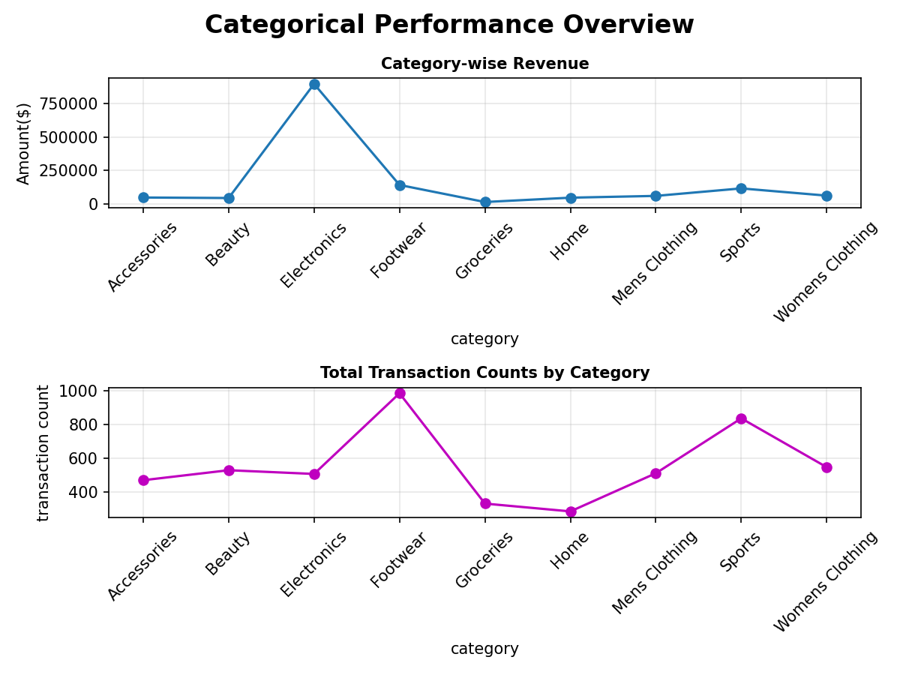

# Retail Sales Analysis

This is my first end-to-end Exploratory Data Analysis (EDA) project in data science using Python. 
It marks an important milestone in my data science learning journey. I'm still building my skills 
and continuously improving my understanding of core concepts.

I'm proud to have completed my first full project today. It has some flaws, as expected for a first 
attempt, but it reflects my genuine effort and learning, being in second semester.

## Objective

This project explores retail sales data to uncover customer purchasing behavior, product performance, 
seasonal trends, and payment preferences with the goal of generating insights that could support 
data-driven business decisions.

## Tools & Libraries Used

- Python
- Pandas
- Matplotlib
- Seaborn

## What This Project Covers

- Customer demographic analysis (age, gender)
- Category-wise performance (revenue, transaction count, ratings)
- Seasonal trends
- Payment method analysis
- Discount impact analysis
- Key insights and business recommendations based on findings

## Dataset

Source: Kaggle — `store_sales.csv`

## Note

I used an AI assistant to help refine grammar and debug some errors during this project, while all 
data interpretation, insights, and analytical decisions are my own.

## About This Project

This is part of my ongoing data science learning journey. Feedback and suggestions are welcome!

## Sample Visualizations

**Category Revenue Performance**

Electronics generates significantly higher revenue despite having a comparable transaction count 
to other categories.

**Seasonal Sales Performance**

Spring shows a slight edge in transaction count across several categories, most notably Footwear.

